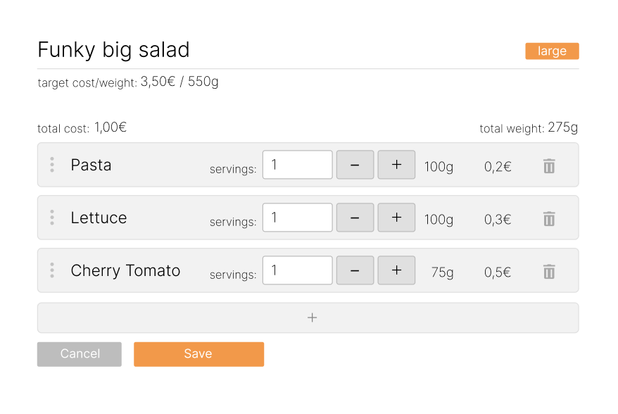

# Salad designer and planner
Quick coding challenge to spice up our hiring processes.
### Technical specs:
- React/Next JS basic app:
  - Simply fork the repo and run `yarn install` followed by `yarn run dev`.
  - It's also packed with `react-redux` and `styled-components` for extra functionality (not necessary to use really).
- Data provided through **REST API endpoints** configured inside Next (see "Data" section for details).

### Challenge Description:
**Mel's Kitchen** is a fancy "salad subscription" company. Customers subscribe to a small, medium or large salad every x days, so we know before hand pretty much how many salads we'll need to produce next week, along with how much we can expect to turn over.

We aim to provide our salad product planners with a tool to design different salads to be produced in a given week, according to demand and product availability.

Our mates at the Salad Design Facility need to rely on an intuitive tool in order to plan out next week's orders, 
and there's where we come in.

Here's a rough idea of the desired behaviour:

- Our main goal is to create "composite" salad products. The tool could look something like this draft (**this 
  is just a visual queue**, you may go in any direction you wish):

  - Editable fields:
    - name of salad
    - type of salad
    - ingredient (name/servings) 

- Each salad will be stored with the following properties (NOTE: due to the simplicity of this project, data 
  structure or types are not enforced, you'll need to ensure consistency in your own code):
  - **id** => integer
  - **name** => string
  - **type** => string (small/medium/large)
  - **ingredients** (products) => array of objects:
    - id => integer
    - numOfServings => integer
  - **cost** => float
  - **price** => float
  - **hoursFresh** => integer (actually, the lowest value present in its ingredients, could be a function or a pre-calculated value).
  - **targetStockByWeekday** => number of these salads needed for a particular weekday.
  - **currentStock** => number of salads in stock.
- We've got a database with next week's available products, here are some notes:
  - The main working unit for salad making is a "**serving**".
  - There's also a **weight per serving** (in grams as of now).
  - Each product belongs to a specific **supplier**.
  - Here's the **product schema**:
    - **id** => integer
    - **name** => string
    - **costPerServing** => float (euros)
    - **weightPerServing** => integer (grams)
    - **hoursFresh** => integer
    - **supplierId** => integer
- There's a bit of business logic in our DataService, and more can be added if needed. The basic info present is:
  - Target **weight** per salad type.
  - Target **cost** per salad type.
  - **Price** per salad type.

The first and basic part of this project is the development of the forementioned tool.

#### Additional tasks
Optionally you may choose to engage in the following extra tasks:

- There are a handful of suppliers and a bunch of **subscriptions**:
  - (\*) We want to know how much we'll need to order from each, after the planning is done.
  - Supplier schema:
    - **id** => integer
    - **name** => string
  - Subscription schema:
    - **id** => integer
    - **name** => string
    - **type** => string
    - **weekdays** => array of integers (1-5)
  - (\*) Additionally, we might want to calculate what products to order **each day** of the week, to ensure freshness. Here are the rules for purchasing:
    - We need to **ensure freshness**.
    - We need to **cut costs** by ordering as much quantity as possible each time.
- (\*) Additionally, we can create a simple(?) **salad recipe tool** for salad manufacture following the design of the salads. Sorting of salad ingredients by drag and drop would be useful for this one.

<footnote>(*) => optional.</footnote>

## Data and REST API
A simple REST API is provided to retrieve/edit app data, from within this same project (no external services required).
Upon starting the server, /api endpoints will be directly available in the localhost:port space.

### Endpoints
- Main route: `/api`
- Resources:
  - `api/products`:
    - `GET` => will fetch all products (that is, individual salad ingredients).
    - `POST` => will update existing records (if IDs are passed) or create new ones.
      - `body` => can be a single JSON object or a collection, in the same format as other records.
  - `api/salads` => each salad product that is designed by our team (see above schema).
    - `GET` and `POST` work just as above.
  - `api/subscriptions` => each individual, regular order by a client.
    - `GET` and `POST` work just as above.
  - `api/reset` => only `POST`, will reset saved data to initial. Body is discarded.

Additionally, `api/suppliers` and `api/businessLogic` are also provided for potential optional features with the 
same simple REST functionality.

TIP: any new first level key added to `initialData` will be accessible as a resource, with the same tooling.
